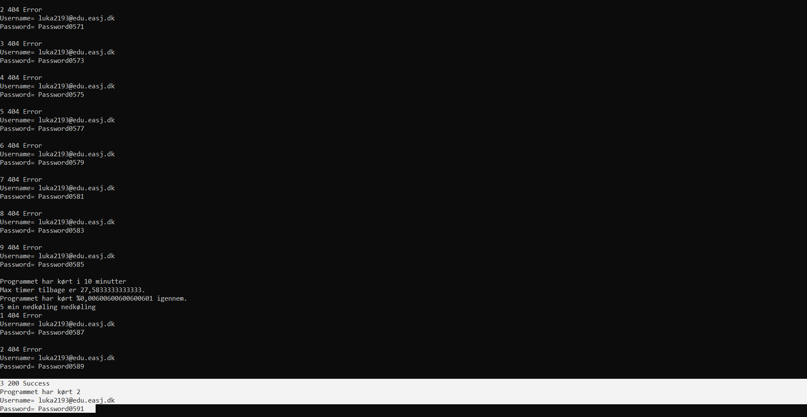
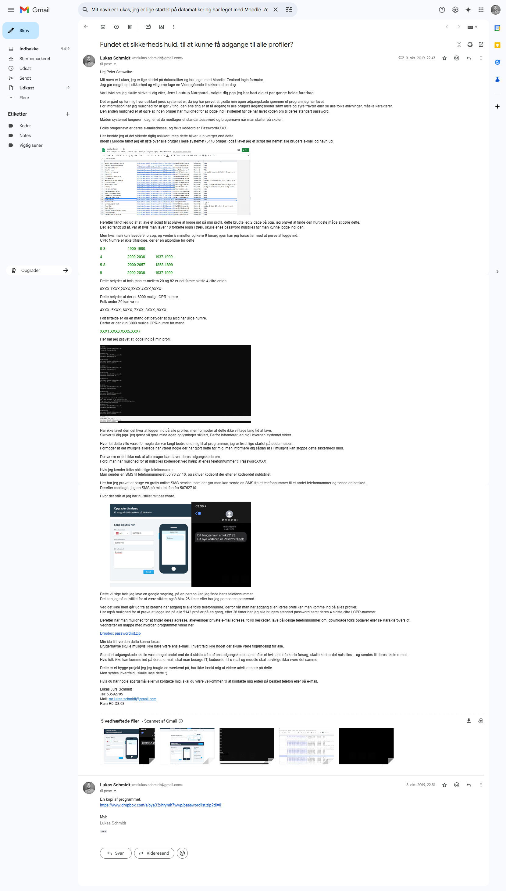

# Sikkerhedsrapport – Moodle (Zealand Login‑formular)

**Afsender:** Lukas Jürs Schmidt  
**Modtager:** Peter Schwalbe  
**Dato:** 3. oktober 2019
---

## Baggrund
Hej Peter,

Mit navn er Lukas, jeg er netop startet på datamatikeruddannelsen, hvor jeg i vores valgfag *IT‑sikkerhed* begyndte at teste skolens Moodle‑login.  
Da jeg går meget op i sikkerhed – og har hørt dig holde flere oplæg – vil jeg gerne dele mine fund direkte med dig.

---

## Problemstilling
Et hurtigt weekend‑projekt afslørede tre alvorlige risici:

1. Uautoriseret adgang til andre brugeres data  
2. Uendelig brute‑force af login‑credentials  
3. Misbrug af kodeordsnulstilling via SMS  

### Brugernavne og adgangskoder
Alle studerende får standard‑login:

- **Brugernavn:** deres e‑mail  
- **Adgangskode:** `PasswordXXXX` (hvor `XXXX` = 4 sidste cifre af CPR)

---

## Angrebsscenarie

### 1. Masseopslag af brugere
- Moodle viser en liste med **5 143 brugere**.  
- Jeg skrev et script der udtrækker navn og e‑mail fra samtlige profiler.

---

### 2. Brute‑force login
- 10 forkerte login låser kontoen, men med 9 forsøg + 5 min ventetid kan angrebet køre uendeligt.  
- CPR‑algoritmen reducerer gæt til ca. 3 000 kombinationer for mænd.

---

### 3. Kodeordsnulstilling via SMS
- En SMS til **50 76 27 10** med teksten `kodeord` nulstiller adgangskoden til `PasswordXXXX`.  
- Dette kan gøres med gratis online‑SMS‑tjenester og offentligt tilgængelige telefonnumre.

---

## Konsekvenser
En angriber kan:

- Skaffe adgang til **alle** konti  
- Ændre telefonnumre og nulstille kodeord  
- Downloade afleveringer, karakterer og beskeder  
- Oprette sig som underviser og omgå adgangskontrol  

---

## Løsningsforslag
- Gør brugernavne mindre forudsigelige (ikke blot e‑mail).  
- Afskaf standard‑adgangskoder baseret på CPR.  
- Indfør CAPTCHA/rate‑limiting på login.  
- Flyt password‑reset til skole‑mail + fysisk fremmøde ved problemer.  
- Sørg for at Moodle og mail ikke deler kodeord.

---

## Dokumentation
Den oprindelige rapport er sendt til dig pr. mail:

---

## Afslutning
Dette var et hyggeprojekt over en weekend, men viser et alvorligt sikkerhedshul.  
Kontakt mig gerne, hvis du har spørgsmål eller ønsker mere information.

**Lukas Jürs Schmidt**  
53 59 27 05  
mr.lukas.schmidt@gmail.com  
Rum R0‑D3.08
